# Hotel_Reservation_potal

File Structure 
Hotel Reservation

 ┣ adminaddhotel.html 
 ┣ adminbookhoteldetails.html 
 ┣ admindashboard.html 
 ┣ adminhoteldetails.html 
 ┣ adminlogin.html 
 ┣ bookhotel.html 
 ┣ db.json 
 ┣ deletehotel.html 
 ┣ index.html 
 ┣ login.html 
 ┣ package-lock.json 
 ┣ package.json 
 ┣ signup.html 
 ┣ updatehotel.html 
 ┗ welcome.html 

 
 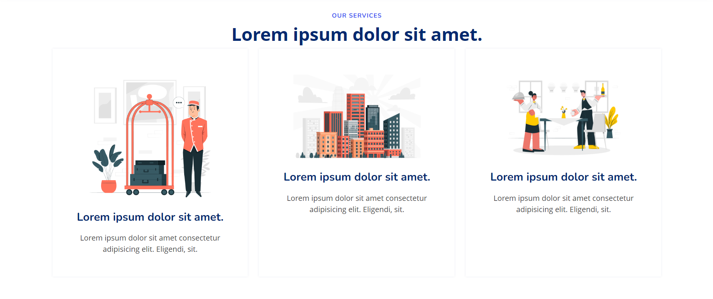
 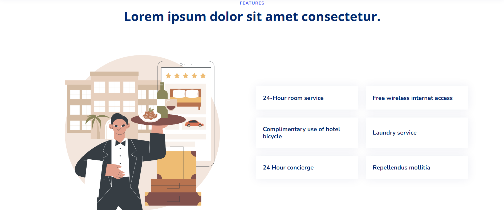
 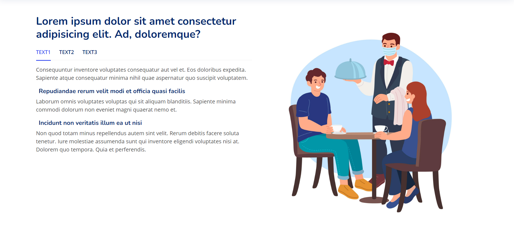
 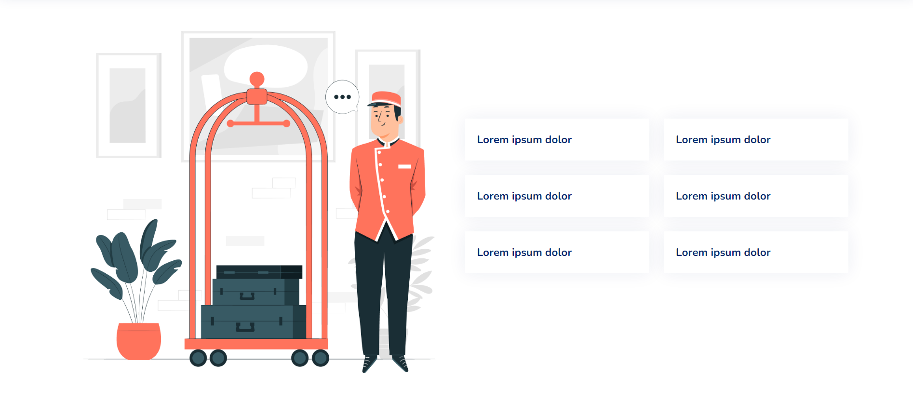
 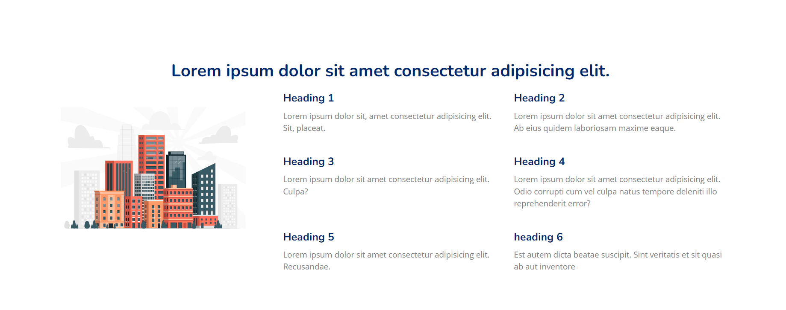
 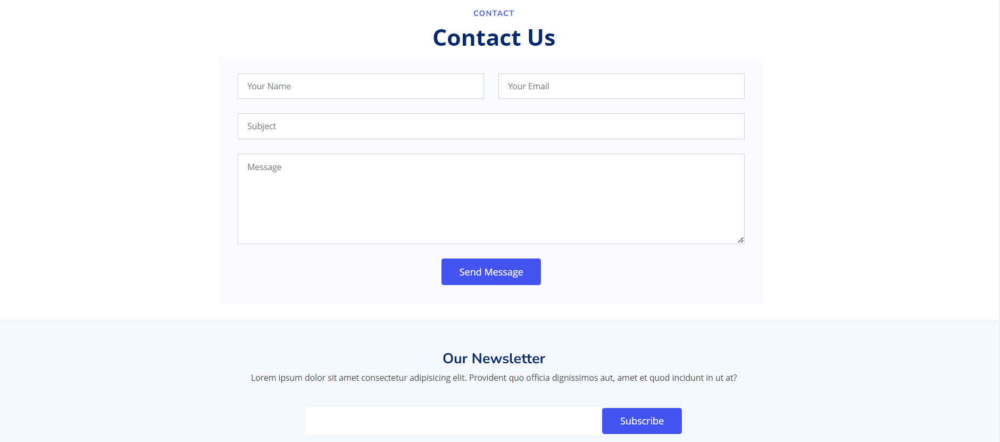
 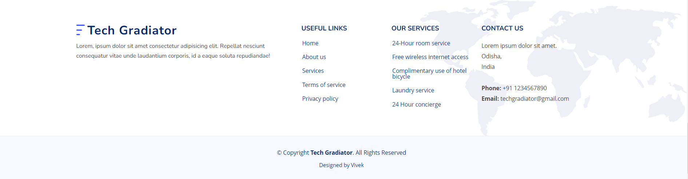

login Page

Signup page

dashboard user
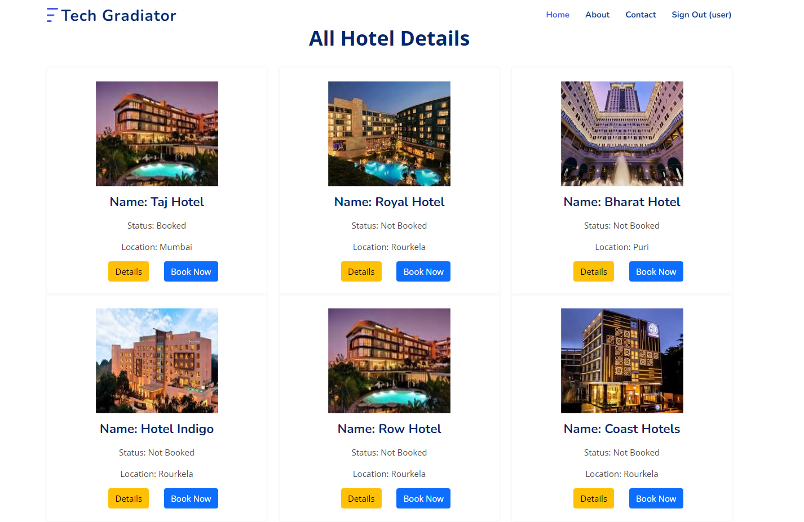
User booking
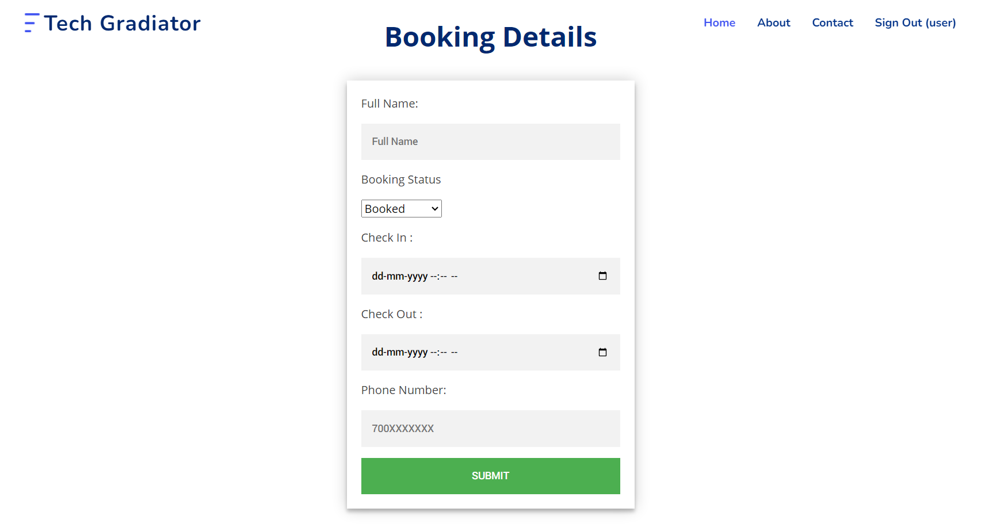
Admin Dashboard
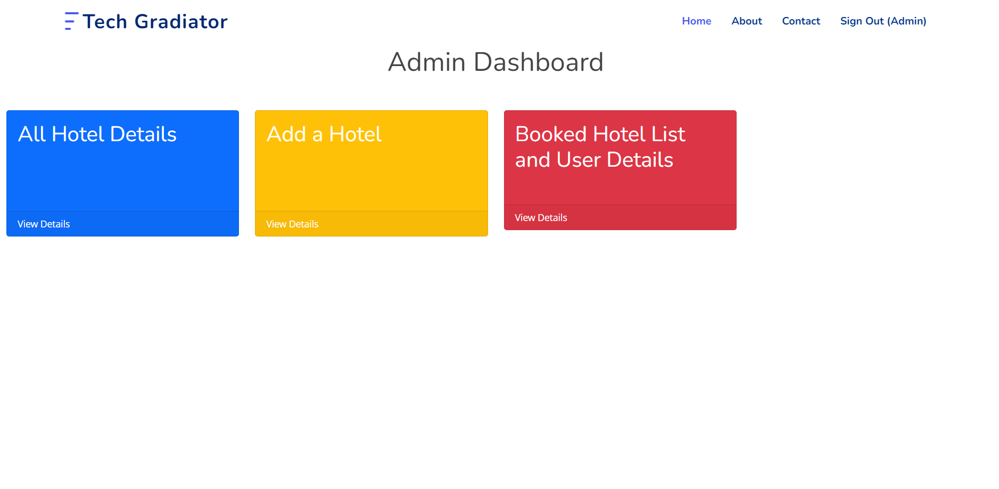
Admin Hotel Details
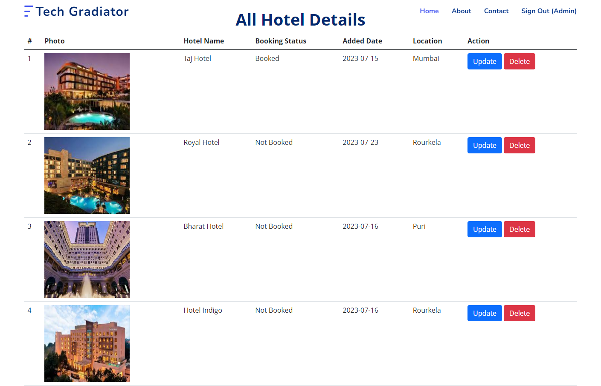
Update Hotel
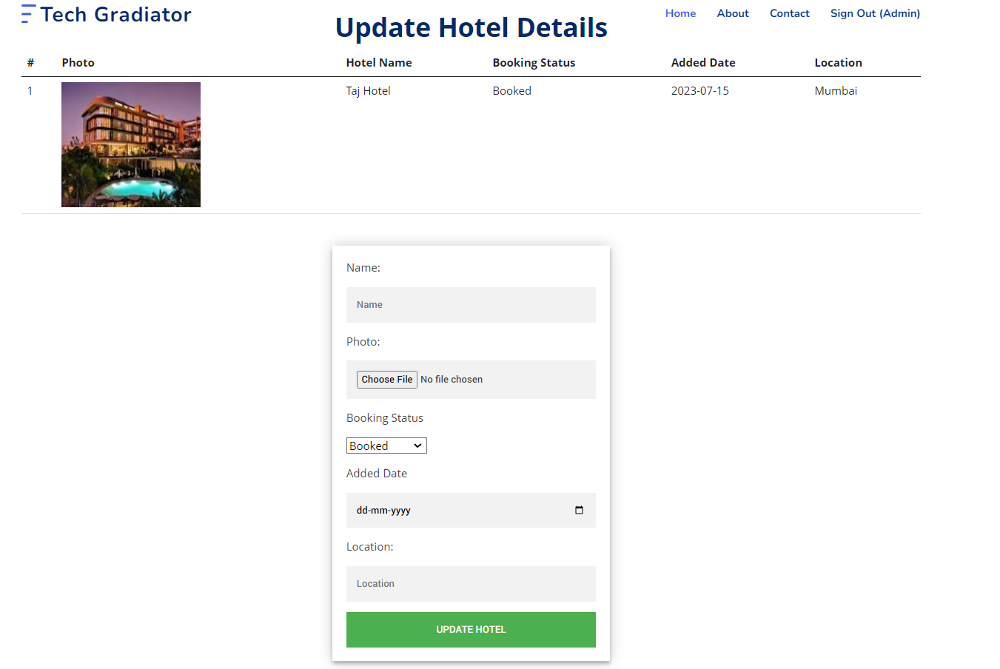
Delete Hotel
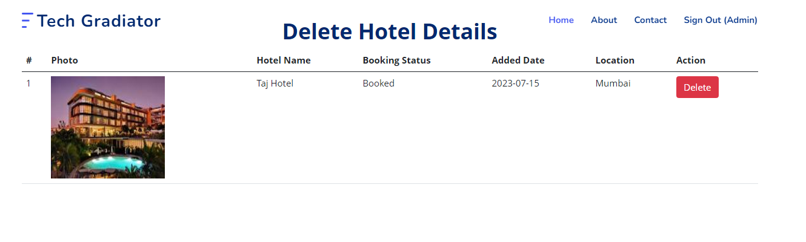
Add Hotel
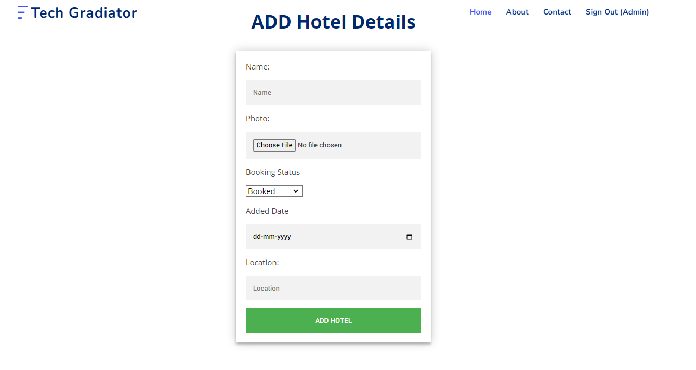
All Customer Details
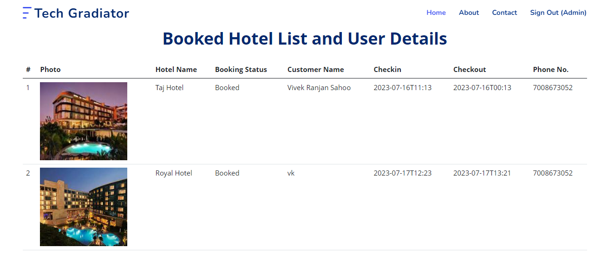
